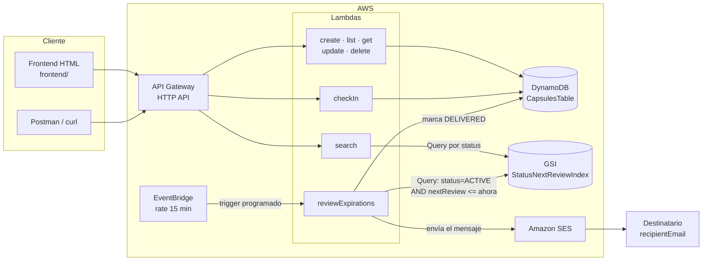

# CRONOS — Documento Técnico

## 1. Entidad Capsule y el patrón dead man's switch

La entidad central de CRONOS es la **Capsule**: un mensaje escrito por un usuario
(`ownerEmail`) dirigido a un destinatario (`recipientEmail`) que se mantiene
sellado hasta que ocurre una condición de *inactividad*. El modelo sigue el
patrón **dead man's switch** ("interruptor de hombre muerto"): en vez de programar
la entrega a una fecha fija, el sistema parte de la premisa *"entregar, salvo que
el dueño demuestre periódicamente que sigue activo"*. Cada check-in reinicia el
temporizador; si el temporizador vence sin check-in, la cápsula se entrega
automáticamente.

Se eligió este patrón porque el objetivo del proyecto es modelar exactamente ese
escenario (el clásico "si algo me pasa, entrega este mensaje"), y además porque
encaja de forma natural con un diseño **serverless orientado a eventos**:

- **No hace falta un proceso vigilante 24/7:** cada cápsula lleva su propia fecha
  de vencimiento (`nextReview`), y una Lambda programada cada 15 minutos
  (`reviewExpirations`) solo tiene que buscar cuáles ya vencieron. Entre
  ejecuciones no se consume cómputo.
- **El estado es explícito y consultable:** el ciclo de vida completo se resume en
  un atributo `status` (`ACTIVE` → `DELIVERED`, o `CANCELLED`), lo que permite
  indexar y filtrar cápsulas eficientemente.

### Atributos de la Capsule

| Atributo | Tipo | Descripción |
|---|---|---|
| `id` | String (UUID) | Identificador único, partition key |
| `ownerEmail` | String | Correo del dueño de la cápsula |
| `recipientEmail` | String | Correo del destinatario del mensaje |
| `message` | String | Contenido (máx. 2000 caracteres) |
| `checkInIntervalHours` | Number | Intervalo máximo entre check-ins |
| `lastCheckIn` | String (ISO 8601) | Momento del último check-in |
| `nextReview` | String (ISO 8601) | `lastCheckIn + checkInIntervalHours`; vencimiento actual |
| `status` | String | `ACTIVE`, `DELIVERED` o `CANCELLED` |
| `createdAt` | String (ISO 8601) | Momento de creación |
| `deliveredAt` | String / null | Momento de entrega (null mientras esté activa) |

## 2. Diseño de la tabla DynamoDB

**Partition key: `id` (String, UUID).** Se eligió un UUID como clave primaria
porque:

- Cada cápsula es independiente: no hay consultas que requieran agrupar cápsulas
  relacionadas bajo una misma partición.
- Los UUID distribuyen uniformemente las escrituras entre particiones, evitando
  hot partitions incluso con muchos usuarios creando cápsulas a la vez.
- Las operaciones CRUD siempre conocen el `id` exacto, por lo que son
  `GetItem`/`PutItem`/`UpdateItem`/`DeleteItem` puntuales — el acceso más barato
  y rápido que ofrece DynamoDB.

### GSI: `StatusNextReviewIndex`

| | |
|---|---|
| **Partition key** | `status` |
| **Sort key** | `nextReview` |
| **Proyección** | `ALL` |

Este índice existe por el flujo de automatización. La Lambda `reviewExpirations`
necesita responder cada 15 minutos: *¿qué cápsulas `ACTIVE` ya tienen su
`nextReview` vencido?* Con el GSI, esa pregunta se resuelve con un **Query**:

```
status = "ACTIVE" AND nextReview <= ahora
```

Gracias a la sort key `nextReview`, DynamoDB devuelve directamente las cápsulas
vencidas ordenadas por fecha de vencimiento, leyendo únicamente los ítems
relevantes. Sin el índice habría que hacer un **Scan** de toda la tabla con un
filtro, pagando lecturas por cada ítem existente aunque ninguno esté vencido.

El mismo GSI se reutiliza para el endpoint `GET /capsules/search?status=...`,
que lista todas las cápsulas de un estado dado usando Query con condición solo
sobre la partition key del índice.

## 3. Diagrama de arquitectura



## 4. Preguntas de reflexión

### 4.1 ¿Por qué Scan puede ser costoso en tablas grandes y cuándo usar Query?

Un `Scan` **lee todos los ítems de la tabla** (hasta 1 MB por llamada) y solo
después aplica el `FilterExpression`. Eso significa que el costo en RCUs crece con
el tamaño total de la tabla, no con la cantidad de resultados: si `CapsulesTable`
tuviera un millón de cápsulas históricas (`DELIVERED`/`CANCELLED`), cada revisión
programada pagaría por leer el millón completo... para descubrir quizá que solo 3
cápsulas vencieron. Y como `reviewExpirations` corre cada 15 minutos, son **96
scans completos al día** de una tabla que solo crece — un desperdicio claro.

Con el GSI `StatusNextReviewIndex`, el mismo trabajo se hace con un `Query`
(`status = ACTIVE AND nextReview <= ahora`), que **solo lee los ítems que cumplen
la condición** y además permite paginación controlada. En el peor caso (nada
vencido) el Query no lee prácticamente nada.

**Regla práctica:** usar `Query` siempre que la consulta se conozca de antemano y
se pueda modelar con una clave (tabla o índice); reservar `Scan` para operaciones
administrativas poco frecuentes o tablas pequeñas — de hecho, `list_capsules`
mantiene el Scan original precisamente porque es un listado general con
paginación, no una consulta filtrada crítica.

### 4.2 ¿Qué ventajas tiene una función Lambda por operación frente a una sola Lambda con todas las rutas?

- **Paquetes más pequeños y arranques en frío más rápidos:** cada Lambda contiene
  solo su propio código, en vez de cargar un router monolítico con las 8
  operaciones.
- **Escalamiento granular:** `reviewExpirations` corre 96 veces al día y `create`
  depende del tráfico; con funciones separadas cada una escala — y se le asigna
  memoria/timeout — según su demanda real.
- **Aislamiento de fallos y despliegues:** un bug en `search` no puede tumbar
  `checkIn`, y se puede redesplegar una sola función sin tocar las demás.
- **Observabilidad clara:** en CloudWatch cada operación tiene sus propias
  métricas y logs (duración, errores, invocaciones), lo que facilita detectar qué
  operación falla sin diseccionar los logs de una función gigante.
- **Permisos y configuración afinables por función** si algún día una operación
  necesita acceso a otros recursos.

La contrapartida (más funciones que administrar) la absorbe Serverless Framework,
que las declara y despliega todas desde un único `serverless.yml`.

### 4.3 ¿Qué pasaría si las funciones tuvieran permiso `dynamodb:*` sobre `*`?

Rompería el principio de **mínimo privilegio** y ampliaría enormemente la
superficie de daño ante cualquier error o vulnerabilidad:

- `dynamodb:*` incluye acciones destructivas como `DeleteTable` o
  `UpdateTimeToLive`: un bug en un handler (o una inyección a través de un
  parámetro mal validado) podría **borrar la tabla entera**, no solo un ítem.
- El recurso `*` daría acceso a **todas las tablas de la cuenta y la región**,
  incluidas las de otros proyectos o con datos sensibles que nada tienen que ver
  con CRONOS.
- En un escenario de credenciales comprometidas, el atacante podría exfiltrar o
  destruir cualquier tabla; con los permisos actuales quedaría confinado a
  operaciones CRUD básicas sobre `CapsulesTable` y su índice.

La configuración actual restringe las acciones a las 6 realmente necesarias
(`PutItem`, `GetItem`, `Query`, `Scan`, `UpdateItem`, `DeleteItem`) y el recurso
al ARN exacto de `CapsulesTable` más el sufijo `/index/StatusNextReviewIndex` —
un detalle importante, porque **los índices tienen su propio ARN y las consultas
al GSI (`search`, `reviewExpirations`) fallarían con AccessDenied si solo se
autorizara el ARN de la tabla**.
